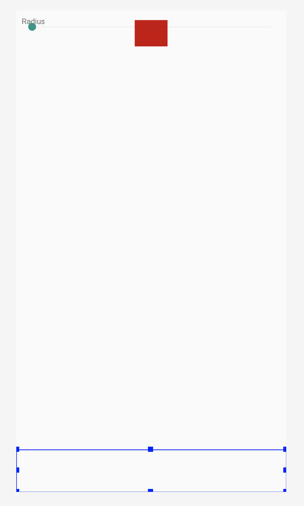
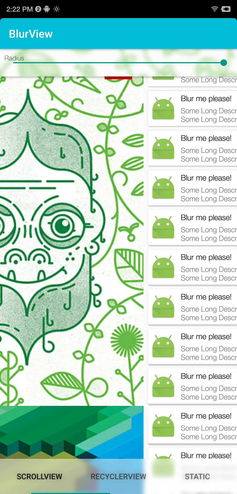
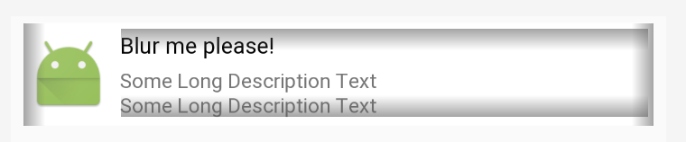

## 层级关系

整体是一个FrameLayout，最底下是一个ViewPager；

上面是BlurViewA，位于上方；

再上面是BlurViewB，位于下方；

再上面是一个红色的ImageView，它位于BlurViewA的上面；

BlurViewA里头有一个FrameLayout，FrameLayout里有一个TextView，有一个SeekBar。

详见BlurView/app/src/main/res/layout/activity_main.xml

在代码里，动态给ViewPager填充数据，这里填充了三个Fragment。

层级图见下面两张图：






## activity_main.xml

### 声明xmlns:app

在xml里写上下面这句话，表示可以使用app里命名空间的资源

```
    xmlns:app="http://schemas.android.com/apk/res-auto"
```

如何使用：

```
<eightbitlab.com.blurview.BlurView
				......
        app:blurOverlayColor="@color/colorOverlay"
        >
```

上面的color值是#78ffffff，即是一个较为透明的白色

```
<color name="colorOverlay">#78ffffff</color>
```

如何定义：

在BlurView/library/src/main/res/values/styles.xml里

```
<?xml version="1.0" encoding="utf-8"?>
<resources>
    <declare-styleable name="BlurView">
        <attr name="blurOverlayColor" format="color"/>
    </declare-styleable>
</resources>
```

代码中如何获取这个color：

BlurView/library/src/main/java/eightbitlab/com/blurview/BlurView.java

```java
@ColorInt
private int overlayColor;
private void init(AttributeSet attrs, int defStyleAttr) {
    TypedArray a = getContext().obtainStyledAttributes(attrs, R.styleable.BlurView, defStyleAttr, 0);
    overlayColor = a.getColor(R.styleable.BlurView_blurOverlayColor, TRANSPARENT);
    a.recycle();
}
```

### android:elevation

```
android:elevation="4dp"
```

- Elevation  海拔的意思，放在view的属性上，意思就是该view的z值。其实就是opengl里我们设置的rect的z值；

- 默认所有的view的elevation都是0dp；

- 当都是0dp的时候，view的先后顺序跟layout有关，但一旦其中有view的elevation不为0dp时，它会根据elevation的大小排列。

- 另外，elevation与阴影挂钩，0dp没有阴影，值越大阴影越深。

  详见：https://www.jianshu.com/p/c1d17a39bc09

### android:outlineProvider

```
android:outlineProvider="bounds"
```

- outline：轮廓的意思

- outlineProvider意思是提供view的轮廓是什么样子的，有四个值可以供其设置"none"，"background"，"bounds"和"paddedBounds"。它是为view阴影提供服务的。
- 在xml布局中，可以通过`android:outlineProvider`来指定轮廓的判定方式：
  1. `none` 即使设置了Z属性，也不会显示阴影
  2. `background` 会按照背景来设置阴影形状
  3. `bounds` 会按照View的大小来描绘阴影
  4. `paddedBounds` 和bounds类似，不过阴影会稍微向右偏移一点

- 在代码中，我们可以通过`setOutlineProvider`来指定一个View的轮廓：

```java
ViewOutlineProvider viewOutlineProvider = new ViewOutlineProvider() {     
  public void getOutline(View view, Outline outline) {         
    // 可以指定圆形，矩形，圆角矩形，path         
    outline.setOval(0, 0, view.getWidth(), view.getHeight());     
  } 
}; 
View.setOutlineProvider(viewOutlineProvider );
```

注意：如果采用图片作为背景，即使在xml布局中指定android:outlineProvider为background也不会显示阴影，只有通过代码中指定轮廓来显示。

详见：https://www.cnblogs.com/McCa/p/4465597.html （链接里还讲了：view的clip(剪裁)；Reveal Effect）

### android:padding

```
android:padding="8dp"
```

- 内边距padding
- android:padding：为组件的四边设置相同的内边距。
- android:paddingLeft：为组件的左边设置内边距。
- android:paddingRight：为组件的右边设置内边距。
- android:paddingTop：为组件的上边设置内边距。
- android:paddingBottom：为组件的下边设置内边距。
- 外边距margin
- android:layout_margin：本组件离上下左右各组件的外边距。
- android:layout_marginBottom：本组件离下部组件的外边距。
- android:layout_marginTop：本组件离上部组件的外边距。
- android:layout_marginLeft：本组件离左部组件的外边距。
- android:layout_marginRight：本组件离右部组件的外边距。
- android:layout_marginStart：本组件离开始的位置的外边距。
- android:layout_marginEnd：本组件离结束位置的外边距。

详见：https://www.cnblogs.com/lonelyxmas/p/7349222.html 

关于marginStart和marginEnd，详见：https://www.jianshu.com/p/86ef59f8c432    &&    https://www.jianshu.com/p/514324f41382

## ViewPager

设置离屏最大page数。

给viewPager设置adpter，参数是一个PagerAdapter。

new ViewPagerAdapter时需要getSupportFragmentManager()。

```java
viewPager.setOffscreenPageLimit(2);
viewPager.setAdapter(new ViewPagerAdapter(getSupportFragmentManager()));
```

ViewPagerAdapter是一个PageAdapter，它继承FragmentPagerAdapter。

FragmentPagerAdapter是Android support v4自带的。

- 重写getItem，返回Fragment

- 重写getPageTitle方法，返回title字符串

- 重写getCount方法，返回Fragment的数量

```java
static class ViewPagerAdapter extends FragmentPagerAdapter {

  ViewPagerAdapter(FragmentManager fragmentManager) {
    super(fragmentManager);
  }

  @Override
  public Fragment getItem(int position) {
    return Page.values()[position].getFragment();
  }

  @Override
  public CharSequence getPageTitle(int position) {
    return Page.values()[position].getTitle();
  }

  @Override
  public int getCount() {
    return Page.values().length;
  }
}
```

### 数据枚举Page

- 学习写法，enum类型的Page；有自己的构造方法；提供abstract方法；在enum里曾经三个Page类型的变量；外面拿的时候直接Page.values()即可，Page[] pages = Page.values();

```java
enum Page {
  FIRST("ScrollView") {
    @Override
    Fragment getFragment() {
      return new ScrollFragment();
    }
  },
  SECOND("RecyclerView") {
    @Override
    Fragment getFragment() {
      return new ListFragment();
    }
  },
  THIRD("Static") {
    @Override
    Fragment getFragment() {
      return new ImageFragment();
    }
  };

  private String title;

  Page(String title) {
    this.title = title;
  }

  String getTitle() {
    return title;
  }

  abstract Fragment getFragment();
}
```

### ScrollFragment

重写getLayoutId方法，然后一个layout。

```java
public class ScrollFragment extends BaseFragment {
    @Override
    int getLayoutId() {
        return R.layout.fragment_scroll;
    }
}
```

#### R.layout.fragment_scroll

- 它最外面是一个ScrollView，里面包了一个LinearLayout。

- LinearLayout里有4个ImageView。

```xml
<?xml version="1.0" encoding="utf-8"?>
<ScrollView xmlns:android="http://schemas.android.com/apk/res/android"
    android:id="@+id/scrollView"
    android:layout_width="match_parent"
    android:layout_height="match_parent"
    android:paddingBottom="@dimen/bottom_tab_height"
    android:clipToPadding="false"
    android:scrollbars="none">

    <LinearLayout
        android:orientation="vertical"
        android:layout_width="match_parent"
        android:layout_height="wrap_content">

        <ImageView
            android:id="@+id/face"
            android:layout_width="match_parent"
            android:layout_height="wrap_content"
            android:adjustViewBounds="true"
            android:src="@drawable/face"/>

        <ImageView
            android:id="@+id/lines"
            android:layout_width="match_parent"
            android:layout_height="wrap_content"
            android:adjustViewBounds="true"
            android:src="@drawable/lines"/>

        <ImageView
            android:id="@+id/fire"
            android:layout_width="match_parent"
            android:layout_height="wrap_content"
            android:adjustViewBounds="true"
            android:src="@drawable/fire"/>

        <ImageView
            android:id="@+id/marine"
            android:layout_width="match_parent"
            android:layout_height="wrap_content"
            android:adjustViewBounds="true"
            android:src="@drawable/marine"/>

    </LinearLayout>

</ScrollView>
```

android:clipToPadding

- TODO

android:scrollbars

TODO

### ListFragment

- 重写getLayoutId方法，返回fragment_list layout
- 重写onViewCreated，初始化recyclerView的adapter和layoutManager
  - setAdapter：参数需要是一个`RecyclerView.Adapter<VH extends RecyclerView.ViewHolder>`
  - setLayoutManager：参数需要是一个RecyclerView.LayoutManager，这里的LinearLayoutManager是`com.android.support.recyclerview-v7:28.0.0`里自带的

```java
public class ListFragment extends BaseFragment {
    @BindView(R.id.recyclerView) RecyclerView recyclerView;

    @Override
    int getLayoutId() {
        return R.layout.fragment_list;
    }

    @Override
    public void onViewCreated(View view, @Nullable Bundle savedInstanceState) {
        super.onViewCreated(view, savedInstanceState);
        init();
    }

    private void init() {
        recyclerView.setAdapter(new ExampleListAdapter(getContext()));
        recyclerView.setLayoutManager(new LinearLayoutManager(getContext()));
    }
}
```

#### ExampleListAdapter

- 该类继承RecyclerView.Adapter
- 泛型ExampleListAdapter.Holder继承RecyclerView.ViewHolder
- 构造函数获取LayoutInflater
- 重写的onCreateViewHolder，返回值是new一个Holder，Holder利用LayoutInflater去inflate一个layout，该layout是list_item
- 重写getItemCount，返回count数

```java
public class ExampleListAdapter extends RecyclerView.Adapter<ExampleListAdapter.Holder> {

    private static final int ITEMS_COUNT = 64;
    private LayoutInflater inflater;

    ExampleListAdapter(Context context) {
        inflater = LayoutInflater.from(context);
    }

    @Override
    @NonNull
    public Holder onCreateViewHolder(@NonNull ViewGroup parent, int viewType) {
        return new Holder(inflater.inflate(R.layout.list_item, parent, false));
    }

    @Override
    public void onBindViewHolder(@NonNull Holder holder, int position) {
    }

    @Override
    public int getItemCount() {
        return ITEMS_COUNT;
    }

    static class Holder extends RecyclerView.ViewHolder {
        Holder(View itemView) {
            super(itemView);
        }
    }
}
```

#### R.layout.list_item

- 最外面是一个CardView
- CardView里面是一个横向的LinearLayout
- 横向LinearLayout里面有一个ImagaView 和 纵向的LinearLayout
- 纵向LinearLayout里有两个TextView，第二个TextView的maxLines是2



```xml
<?xml version="1.0" encoding="utf-8"?>
<android.support.v7.widget.CardView
    xmlns:android="http://schemas.android.com/apk/res/android"
    android:orientation="vertical"
    android:layout_width="match_parent"
    android:layout_height="wrap_content"
    android:layout_marginLeft="@dimen/half_margin"
    android:layout_marginTop="@dimen/small_margin"
    android:layout_marginBottom="@dimen/small_margin"
    android:layout_marginRight="@dimen/half_margin"
    android:clickable="true"
    android:foreground="?attr/selectableItemBackground">

    <LinearLayout
        android:orientation="horizontal"
        android:layout_width="match_parent"
        android:layout_height="match_parent">

        <ImageView
            android:id="@+id/thumb"
            android:layout_width="wrap_content"
            android:layout_height="wrap_content"
            android:padding="4dp"
            android:layout_gravity="center"
            android:src="@mipmap/list_item_thumb"/>

        <LinearLayout
            android:layout_width="match_parent"
            android:layout_height="wrap_content"
            android:layout_margin="@dimen/small_margin"
            android:layout_gravity="center_vertical"
            android:orientation="vertical">

            <TextView
                android:id="@+id/title"
                android:layout_width="wrap_content"
                android:layout_height="wrap_content"
                android:textColor="@android:color/black"
                android:layout_marginBottom="@dimen/small_margin"
                android:maxLines="1"
                android:text="@string/blur_me"/>

            <TextView
                android:id="@+id/description"
                android:layout_width="wrap_content"
                android:layout_height="wrap_content"
                android:maxLines="2"
                android:textSize="13sp"
                android:text="@string/description_text"/>

        </LinearLayout>

    </LinearLayout>

</android.support.v7.widget.CardView>

```

### ImageFragment

- 重写getLayoutId方法，返回fragment_image的layout

```java
public class ImageFragment extends BaseFragment {
    @Override
    int getLayoutId() {
        return R.layout.fragment_image;
    }
}
```

#### R.layout.fragment_image

- 里面就是一个ImageView

```xml
<?xml version="1.0" encoding="utf-8"?>
<ImageView xmlns:android="http://schemas.android.com/apk/res/android"
    android:orientation="vertical"
    android:layout_width="match_parent"
    android:layout_height="wrap_content"
    android:adjustViewBounds="true"
    android:src="@drawable/trees"/>
```


## SeekBar

- 设置Seekbar的初始progress
- setOnSeekBarChangeListener

```java
// seekBar的progress最大是100。step * radius = 100
final float radius = 25f;
final float step = 4f;
int initialProgress = (int) (radius * step);
radiusSeekBar.setProgress(initialProgress);

radiusSeekBar.setOnSeekBarChangeListener(new SeekBarListenerAdapter() {
  @Override
  public void onProgressChanged(SeekBar seekBar, int progress, boolean fromUser) {
    float blurRadius = progress / step;
    blurRadius = Math.max(blurRadius, minBlurRadius);
    topBlurView.setBlurRadius(blurRadius);
    bottomBlurView.setBlurRadius(blurRadius);
  }
});
```

```xml
<SeekBar
         android:id="@+id/radiusSeekBar"
         android:layout_width="match_parent"
         android:layout_height="wrap_content"
         android:padding="8dp"/>
```


## BlockingBlurController

该demo最关键的类，也是控制做blur的地方。

to see BlurView/library/src/main/java/eightbitlab/com/blurview/BlockingBlurController.java


## @SuppressWarnings("WeakerAccess")

- 将方法块里面的warning取消

- 当Android编译java代码的时候，经常会遇到一些warning，有一些是自己写得不规范，可以根据建议来修改，而有一些是你觉得必要的，不能修改的，比如说某些方法未被使用的warning。出现这种情况，你可以使用@Suppresswarnings来解决.

- Access can be package-private

  - 使用@SuppressWarnings("WeakerAccess")忽略这个警告

- 实在不知道对应的忽略方法，终极方法@SuppressWarnings("all") 

  | name                     | using                                                        |
  | :----------------------- | :----------------------------------------------------------- |
  | all                      | to suppress all warnings （将方法块里面所有的warning都取消） |
  | cast                     | to suppress warnings relative to cast operations             |
  | dep-ann                  | to suppress warnings relative to deprecated annotation （取消对已弃用的注释的警告） |
  | deprecation              | to suppress warnings relative to deprecation（  使用了不赞成使用的类或方法时的警告） |
  | fallthrough              | to suppress warnings relative to missing breaks in switch statements（当 Switch 程序块直接通往下一种情况而没有 Break 时的警告。） |
  | finally                  | to suppress warnings relative to finally block that don’t return（任何 finally 子句不能正常完成时的警告） |
  | hiding                   | to suppress warnings relative to locals that hide variable（取消对隐藏变量的警告） |
  | incomplete-switch        | to suppress warnings relative to missing entries in a switch statement (enum case) （取消对switch里面缺少case条目的警告） |
  | null                     | to suppress warnings relative to null analysis（取消对null分析的警告） |
  | nls                      | to suppress warnings relative to non-nls string literals （取消对 non-nls字符串的警告） |
  | path                     | 在类路径、源文件路径等中有不存在的路径时的警告。             |
  | rawtypes                 | to suppress warnings relative to un-specific types when using generics on class params （当在类参数中使用非特定的泛型时，取消警告） |
  | restriction              | to suppress warnings relative to usage of discouraged or forbidden references （取消使用不鼓励或禁止的引用的警告） |
  | serial                   | to suppress warnings relative to missing serialVersionUID field for a serializable class（当在可序列化的类上缺少 serialVersionUID 定义时的警告。） |
  | static-access            | to suppress warnings relative to incorrect static access（取消不正常的静态访问的警告） |
  | synthetic-access         | to suppress warnings relative to unoptimized access from inner classes |
  | unchecked                | to suppress warnings relative to unchecked operations（执行了未检查的转换时的警告，例如当使用集合时没有用泛型 (Generics) 来指定集合保存的类型。） |
  | unqualified-field-access | to suppress warnings relative to field access unqualified    |
  | unused                   | to suppress warnings relative to unused code （将未使用的方法的warning取消） |
  | WeakerAccess             | 禁止“Access can be private”的警告                            |

详见：https://www.jianshu.com/p/d60d6027ef0b

详见：https://www.jianshu.com/p/0ce06ec16b25


because it wouldn't bring any performance benefits

因为它不会带来任何性能上的好处.


center_horizontal 横向的中心

center_vertical      纵向的中心


declare 宣布；声明